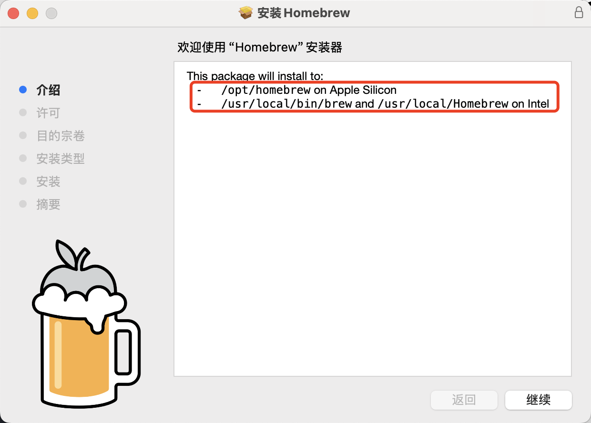

# MAC安装

mac以前会自带2.7版本的python，现在会在安装命令行工具后默认安装3.9.6版本的python。
这里讨论的情况是mac本体已经带了3.9.6版本的python。命令行检查为：

```bash
mcd@maidanglaodeMacBook-Air ~ % where python3
/usr/bin/python3
```

## 一、安装Homebrew

Homebrew官网为：https://brew.sh/
可以使用官网里面的命令进行安装（需要翻墙环境），也可以使用官网里面推荐的pkg安装

### 安装后brew显示not found

这基本上是pkg安装后的问题，原因是环境变量没有设置好。

1. 确定homebrew位置
    在pkg安装的界面可以看到它会安装在哪个位置
    

2. 编辑/etc/profile文件
    ```bash
    sudo vim /etc/profile
    ```
    按`i`进入编辑模式，在文件最后写入以下内容
    ```txt
    export PATH="/opt/homebrew/bin:$PATH"
    ```

    按`esc`退出编辑模式，输入`:wq!`保存文件并退出vim
    执行
    ```bash
    source /etc/profile
    ```

## 二、通过homebrew安装python

安装python
```bash
brew install python3
```

指定版本
```bash
brew install python3@3.10
```

## 三、指定系统默认版本

brew安装完python的时候会有一系列文本：
```bash
Python is installed as
  /opt/homebrew/bin/python3.10

Unversioned and major-versioned symlinks `python`, `python3`, `python-config`, `python3-config`, `pip`, `pip3`, etc. pointing to
`python3.10`, `python3.10-config`, `pip3.10` etc., respectively, are installed into
  /opt/homebrew/opt/python@3.10/libexec/bin

You can install Python packages with
  pip3.10 install <package>
They will install into the site-package directory
  /opt/homebrew/lib/python3.10/site-packages

tkinter is no longer included with this formula, but it is available separately:
  brew install python-tk@3.10

If you do not need a specific version of Python, and always want Homebrew's `python3` in your PATH:
  brew install python3

See: https://docs.brew.sh/Homebrew-and-Python
```
这里说明了python3.10和pip3.10安装在了哪里，如果没有保存文本，可以通过命令`where python3.10`查询

1. 编辑`~/.zshrc`文件

    ```bash
    vim ~/.zshrc
    ```

2. 按`i`键进入编辑模式，在文件最后添加内容

    ```bash
    export PATH="/opt/homebrew/bin:$PATH"
    alias python3='/opt/homebrew/bin/python3.10'
    alias pip3='/opt/homebrew/bin/pip3.10'
    ```

    按`esc`退出编辑模式，输入`:wq!`保存文件并退出vim
    执行
    ```bash
    source ~/.zshrc
    ```
### 如果需要频繁的切换python版本，建议先安装python包管理器pyenv